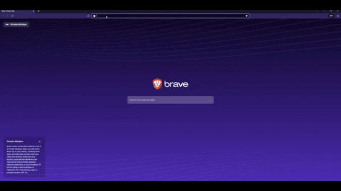
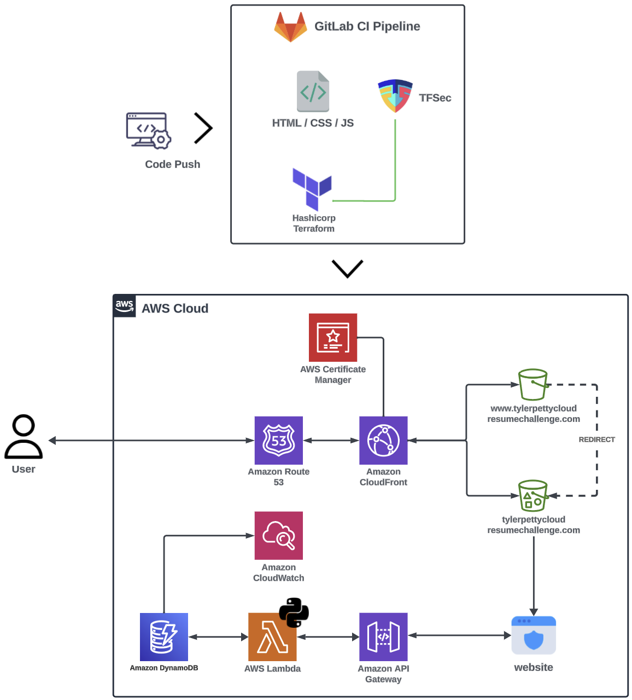

# AWS Cloud Resume Challenge

## Overview

This project is my submission for the AWS Cloud Resume Challenge, a hands-on learning experience to showcase proficiency in Amazon Web Services (AWS) by building a resume-styled website hosted entirely on AWS serverless infrastructure.

## Technologies Used

- **AWS Services:**
  - Route53
  - CloudFront
  - Certificate Manager
  - Amazon S3
  - API Gateway
  - AWS Lambda
  - DynamoDB
  - CloudWatch

- **Tools & Frameworks:**
  - git
  - HTML, CSS, JavaScript
  - HashiCorp Terraform
  - GitLab CI
  - Aquasec tfsec 

## Project Structure

- **`/assets`**: Contains the source code for the resume website.
- **`/terraforms`**: Holds the Terraform modules created and used to define the AWS infrastructure.
- **`.gitlab-ci.yml`**: The GitLab CI configuration for deployment
- **`/images`**: Screenshot for this README depicting the architecture

## Architecture 

### Overview

#### How it works
AWS S3 is perfect for hosting static websites i.e. webpages that display fixed content and do not update based on user interactions. 

When a user navigates to the website, Route53 DNS kicks in and redirects the request to CloudFront. CloudFront serves as a content delivery network (CDN) enabling caching to speed up requests. It also enables HTTP/S (session encryption) by accepting a Certificate from Certificate Manager. 

As users navigate to the website, a bit of JavaScript (JS) code executes. This JS code updates the webpage to showcase how many users have viewed the website. It does this by contacting an Amazon API Gateway that triggers a Lambda function. This Lambda function is a bit of Python code that updates an Amazon DynamoDB table and retrieves the new value. 

#### How it's deployed
A GitLab CI pipeline (.gitlab-ci.yml file) deploys the code. This ensures consistent and automated deployments. The website that you see is just HTML/CSS/JS code. The backend AWS infrastructure gets deployed via Terraform, an Infrastructure as Code (IaC) language. 

Defining IaC using Terraform is the way to go. It provides several benefits like code consistency, repeatability, predictability, scalability, resource state management, automation, and more! Since the infrastructure gets defined as code, we can easily incorporate code scanning. I used TFSec, which
scans the Terraform code and identifies misconfigurations to address. The scans happen automatically each time the code gets pushed to GitLab. 

Once the code successfully passes each GitLab pipeline job, it's ready to deploy into AWS. After I push "deploy", GitLab authenticates to my AWS account and deploys the code.
